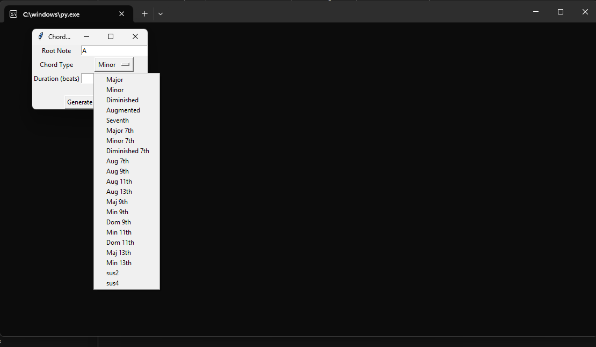
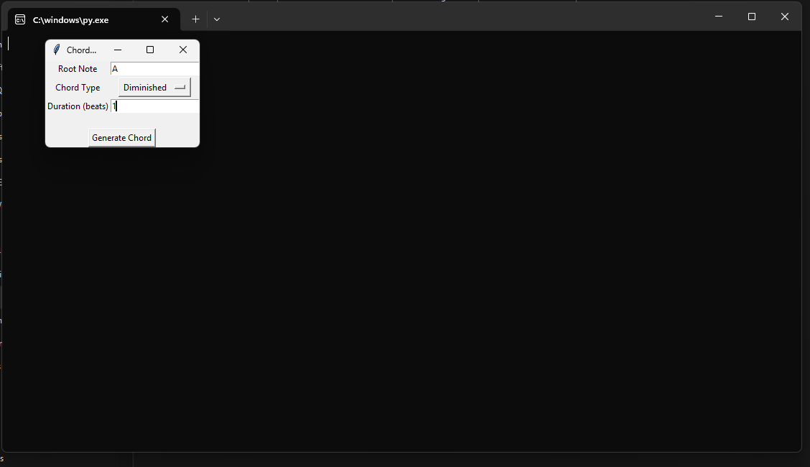
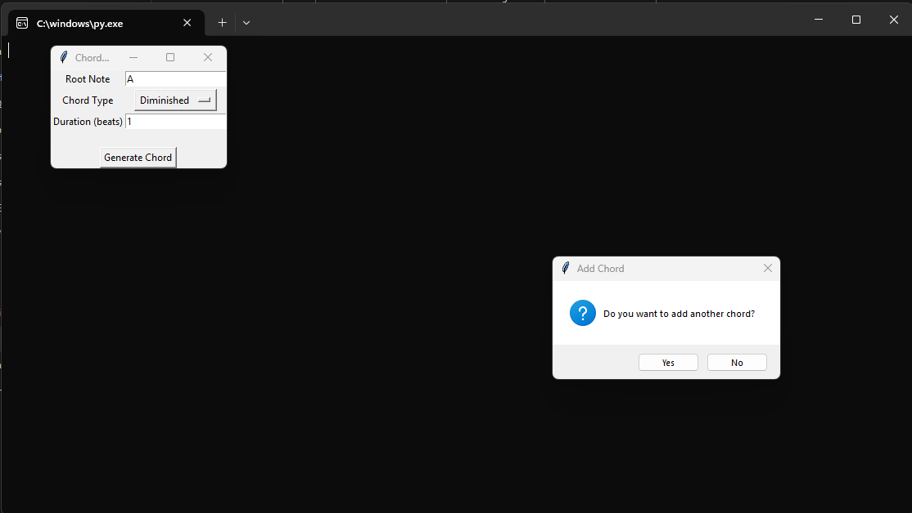
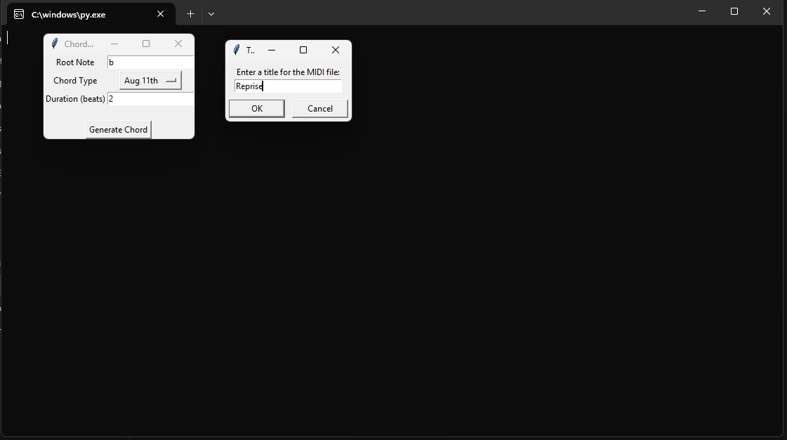
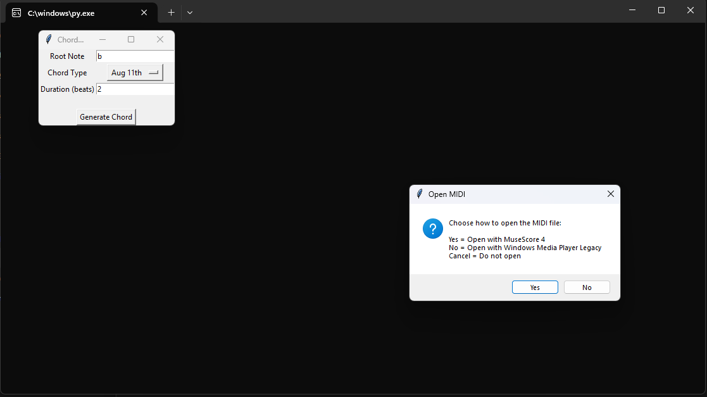

23/01/24 Added rudimentary cord progression file
07/01/2024 Tested for Midi file output via new VS install
01/03/2025 Added facility for User to title to Progressions
01/03/2025 Added funtionality for user to open Midi in either MuseScore 3 or Windows Media Player Legacy if installed
02/03/2024 Changed ptions to open in MuseScore Studio 4 instead of MuseScore 3

******NB Current file containing these enhancements is  chordTen.py ***********

"Flat" Root notes eg "Ab" not currently recognised as valid user input, Sharp root notes(eg A#) & natural (eg A) working.

Chord Structure Generator
This Python application generates MIDI files by creating chord progressions. The user can select a root note, choose a chord type, and specify the duration of each chord. The program then generates the chord and saves it as a MIDI file. The MIDI file can be opened with external applications such as MuseScore or Windows Media Player.

Features
Chord Generation: Select from a variety of chord types (e.g., Major, Minor, Diminished, Augmented, etc.).
Custom Root Note: Choose the root note of the chord (e.g., C, D#, F#).
MIDI File Creation: The generated chords are saved into a MIDI file.
Open with External Programs: Option to open the generated MIDI file with MuseScore 3 or Windows Media Player Legacy.
Requirements
Python 3.x
Required Python libraries:
tkinter (for the GUI)
midiutil (for generating MIDI files)
You can install the necessary libraries using pip:

bash
Copy
Edit
pip install midiutil
How to Use
Run the Application: Start the application by running the script in a Python environment.

bash
Copy
Edit
python chord_structure_generator.py
Input Parameters:

Root Note: Enter the root note (e.g., C, D#, F#).
Chord Type: Select the chord type from the dropdown (e.g., Major, Minor, Seventh).
Duration: Specify the duration of the chord (in beats).
Generate the Chord: After inputting the details, click on the Generate Chord button. The chord will be added to the MIDI file.

Save and Exit: When you're done adding chords, click Save and Exit. You'll be prompted to provide a title for the MIDI file. The file will be saved with an incremental suffix to ensure unique filenames.

Opening the MIDI File: After saving the file, you'll have the option to open it using:

MuseScore 3 (if installed).
Windows Media Player Legacy (if installed).
Alternatively, you can choose not to open the file immediately.
Script Overview
GUI: The application uses tkinter to create a simple graphical interface for user input.
Chord Types: Supports various chord types including Major, Minor, Diminished, Augmented, and more.
MIDI File Creation: Uses the midiutil library to create and save MIDI files.
External Programs: Attempts to open the generated MIDI file with MuseScore 3 or Windows Media Player Legacy.
Code Explanation
The code defines several parts:

Chord Types: A dictionary of chord types with corresponding note intervals.
Note Mapping: A dictionary that maps note names (like C, D#, F) to MIDI note numbers.
Functions:
generate_chord(): Handles chord generation and adds the chord to the MIDI file.
save_and_exit(): Prompts the user to save the MIDI file and provides options for opening it with external programs.
Example
Enter C as the root note.
Select Major as the chord type.
Set the duration to 4 beats.
Click Generate Chord to add the chord to the MIDI file.
After generating chords, click Save and Exit, then provide a title for the MIDI file.

img source ="Chord1.png"
The generated MIDI file will be saved and ready to play!

License
This project is licensed under the MIT License - see the LICENSE file for details.

A small Python script for download. 
Will generate either a single chord or a chord progression, allow the user to name the output and save to the same directory that contains the script itself. 
Also gives the option of opening the newly created midi file in MuseScore Studio 4 or Windows Player Legacy

 

On executing the script a UI screen opens to allow the user to input the first parameters: 

The process is fairly intuitive, the user enters the root note of the first chord.
Currently the accepted inputs are A,B,C,D,E,F,G plus sharps (#) where music notation is applicable - there is currently no text support to allow input for "flat" notes:

With the root selected the user can then select the chord type:

Then the duration can be set (currently 1 = one crotchet/quarter note):

Clicking on "Generate Chord" will bring up a prompt to add another chord: 

If the usere wants to continue building a sequence they repeat the above sequence

Once the User chooses to end the input they are presented with an option to give the progression a name

Clicking "Okay" will save the MIDI file into the same directory that hosts the script and also options to open the MIDI in either MuseScore Studio 4 or Windows Media Player Legacy

There is currently no progression suggestions, no support for time signatures, no support for triplets = the idea is simply to provide a quick and easy way to get a skeleton of your peice into a mid format for you to use in a DAW
